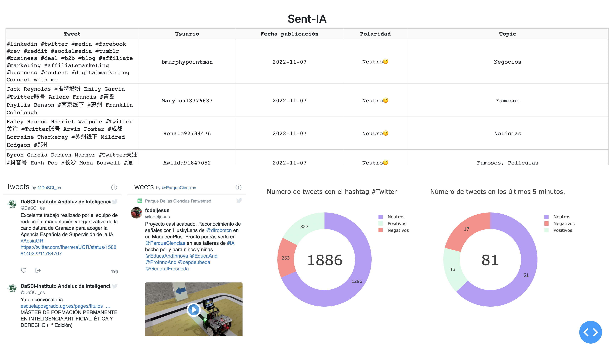

# TwitterAPI-Test
Repository to test de Twitter API

**NOTE: I don't upload the credentials.py file as are unique for each user. The credentials must be obtained in the developer portal.**

The code in **app_hashtag** will be used in the *Artificial Intelligence exhibition at the Granada Science Park* from **November 15, 2022**.
The code in **app_user** will be improved to be ready for exhibition by **January 2023**.

To run the app_hashtag.py file it is necessary to have and advanced credentials in order to add data to the database.
For the database I use **SQLite**, I used *SQL* but **SQLite** it's better for the
requirements that the app has. The steps should be:
- Open one terminal to execute the scrips that download tweets: *python main.py*
- Open another terminal to start using the app: *python app_hashtag.py*

Once you have SQLite installed, you need to create the *test.db* file, archive for the database. I added
an empty one for a faster deployment.

The file "descriptions_of_emojis.csv" was took from the repository: https://github.com/cristinazuhe/Emojis_Description/blob/master/descriptions_of_emojis.csv

File app_hashtag.py shows a table with tweets, and some statistics about them and two timelines for the ScienPark and DaSCI Twitter accounts.

Example 1 of app_hashtag:

